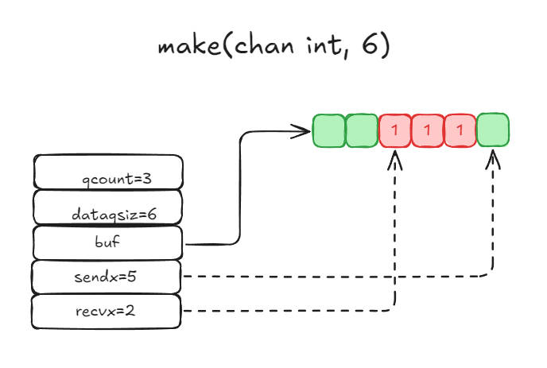
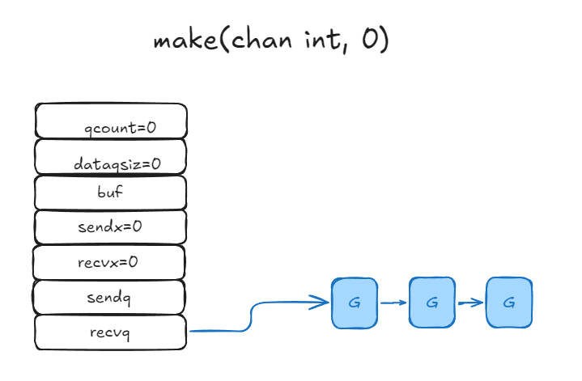

<!-- more -->

### 目录

- [一、什么是 Channel](#一什么是-channel)
- [二、Channel 结构](#二channel-结构)
- [三、Channel 读写](#三channel-读写)
- [四、Channel 常见用法](#四channel-常见用法)
- [五、Channel 应用](#五channel-应用)

#### 一、什么是 Channel

- `Channel` 是 Go 语言中的一种数据类型，用于在不同的 Goroutine 之间进行通信和同步。它是一种特殊的类型，可以用来传递数据，也可以用来传递信号。如果需要跨进程通信，建议使用分布式系统的方法来解决。

- `Channel` 可以分为两种类型：无缓冲的 `Channel` 和有缓冲的 `Channel`。
  - 无缓冲的 `Channel` 在发送和接收操作之间没有缓冲区，因此发送操作和接收操作必须同时进行，否则会阻塞。
  - 而有缓冲的 `Channel` 在发送和接收操作之间有一个缓冲区，因此发送操作和接收操作可以异步进行，只有当缓冲区满时发送操作才会阻塞，只有当缓冲区空时接收操作才会阻塞。

<hr style="background-color: blue;border: none;height: 10px;opacity: .1;width: 100%" />

#### 二、Channel 结构

1. chan 的数据结构

    ```
    type hchan struct {
    qcount   uint           // 队列中存储的总数据量，当前队列中剩余元素个数。
    dataqsiz uint           // 环形队列的大小，即循环队列中可以存储的最大元素个数。
    buf      unsafe.Pointer // 环形队列指针
    elemsize uint16 // 元素大小
    closed   uint32 // Channel 是否关闭
    elemtype *_type // 元素类型
        // send/recv 可以看作针对这个队列操作，向这个队列Send(发送)消息，即写消息；从这个队列Recv(接受)消息，即读消息。
    sendx    uint   // 队列下标，指元素写入时放到队列中的位置
    recvx    uint   // 队列下标，指元素从队列的哪个位置读出
    recvq    waitq  // 等待读消息的goroutine队列
    sendq    waitq  // 等待写消息的goroutine队列

    // lock protects all fields in hchan, as well as several
    // fields in sudogs blocked on this channel.
    //
    // Do not change another G's status while holding this lock
    // (in particular, do not ready a G), as this can deadlock
    // with stack shrinking.
    lock mutex // 互斥锁，不允许并发读写
    }
    ```

2. 环形队列

    > chan 内部实现了一个环形队列作为其缓冲区，队列的长度是创建时指定的。

    > 下图展示了一个可缓冲6个元素的channel，类型为int的示意图:

    

    - qcount: 表示队列中还有3个元素；
    - dataqsiz: 表示队列能容纳6个元素；
    - buf 环形队列的指针，指向队列的内存，这里队列还剩下3个int类型的元素；
    - sendx: 表示队列下一个写入的位置，这里是队列的索引5；
    - recvx: 表示队列下一个读取的位置，这里是队列的索引2。

3. 等待队列
    > 从channel读数据，如果channel缓冲区为空或者没有缓冲区，当前goroutine会被阻塞。
    >
    > 向channel写数据，如果channel缓冲区已满或者没有缓冲区，当前goroutine会被阻塞。

    > 被阻塞的goroutine将会被挂在channel的等待队列中：
    >> 因**读**阻塞的goroutine会被挂在**recvq**队列中；会被向channel**写**数据的goroutine唤醒。
    >>
    >> 因**写**阻塞的goroutine会被挂在**sendq**队列中；会被从channel**读**数据的goroutine唤醒。

    > 下图展示了一个没有缓冲区的channel,有几个goroutine阻塞等待读数据。
        

    注意，一般情况下recvq和sendq至少有一个为空。只有一个例外，那就是同一个goroutine使用select语句向channel一边写数据，一边读数据。

4. 类型信息
    > 一个channel 只能传递一种类型的值，类型信息存储在hchan结构体中的elemtype字段。

    - elemtype *_type // 元素类型, 用于数据传递过程中的赋值
    - elemsize uint16 // 元素大小, 内存对齐, 用于buf中定位元素位置

5. 锁

    > 一个channel同时仅允许被一个goroutine读写，为了保证这个特性，channel内部实现了一个互斥锁，对channel的读写操作均需要先获取这个锁。

<div style="text-align: right;">
    <a href="#目录" style="text-decoration: none;">Top</a>
</div>

<hr style="background-color: blue;border: none;height: 10px;opacity: .1;width: 100%" />

#### 三、Channel 读写

1. 创建 channel

    > 创建channel 的过程实际上是初始化hchan结构体的过程，底层会根据传入的参数初始化hchan结构体中的各个字段。

    > 其中类型信息和缓冲区长度由make语句传入，buf的大小则与元素大小和缓冲区长度共同决定。

    > 创建channel的伪代码如下所示：

    ```
        func makechan(t *chantype, size int) *hchan{
            var c *hchan
            c = new(hchan)
            c.buf = malloc(元素类型大小*size)
            c.elemsize = uint16(元素类型大小)
            c.elemtype = 元素类型
            c.dataqsiz = uint(size)
            return c
        }
    ```

2. 向channel 写数据

    > 向channel写数据时，会先根据channel的类型检查写入数据的类型是否正确，不正确会panic。
    >
    > 如果等待接收队列recvq不为空，说明缓冲区中没有数据或者没有缓冲区，此时直接从receq取出G，并把数据写入，最后把该G唤醒，结束发送过程。
    >
    > 如果缓冲区有空余位置，将数据写入缓冲区，结束发送进程。
    >
    > 如果缓冲区没有空余位置，将发送数据写入G，将当前G加入sendq，进入睡眠，等待被读groutine唤醒。
    >

3. 从channel 读数据

    > 从channel读数据时，会先根据channel的类型检查读取数据的类型是否正确，不正确会panic。
    >
    > 1. 如果等待发送队列sendq不为空，且没有缓冲区，直接从sendq中取出G，把G中数据读出，最后把G唤醒，结束读取过程。
    > 2. 如果等待发送队列sendq不为空，此时说明缓冲区已满，从缓冲区中首部读出数据，把G中数据写入缓冲区尾部，把G唤醒，结束读取过程。
    > 3. 如果缓冲区中有数据，则从缓冲区取出数据，结束读取过程。
    > 4. 将当前goroutine加入recv1，进入睡眠，等待被写goroutine唤醒。

4. 关闭channel

    关闭channel时会把receq中的G全部唤醒，本该写入G的数据位置为nil。把sendq中的G全部唤醒，但这些G会panic。

    除此之外，panic 出现的常见场景还有:

    1. 关闭值为nil的channel
    2. 关闭已经被关闭的channel
    3. 向已经关闭的channel写数据

<div style="text-align: right;">
    <a href="#目录" style="text-decoration: none;">Top</a>
</div>
<hr style="background-color: blue;border: none;height: 10px;opacity: .1;width: 100%" />

#### 四、Channel 常见用法

1. 单向 channel

    顾名思义，单向channel指只能用于发送或接收数据，实际上也没有单向channel.

    我们知道channel可以通过参数传递，所谓单向channel 只是对channel的一种使用限制，这跟C语言使用const修饰函数为只读是一个道理。

    - func readChan(chanName <-chan int): 通过形参限定函数内部只能从channel中读取数据。
    - func writeChan(chanName chan<- int): 通过形参限定函数内部只能向channel中写入数据。

    一个简单的示例如下：

    ```
    func readChan(ch <-chan int) {
        for {
            if data, ok := <-ch; ok {
                fmt.Println(data)
            } else {
                break
            }
        }
    }

    func writeChan(ch chan<- int) {
        for i := 0; i < 10; i++ {
            ch <- i
        }
        close(ch)
    }

    func main() {
        ch := make(chan int, 10)
        go writeChan(ch)
        readChan(ch)
    }
    ```

    ch 是个正常的channel, 而readeChan()形参限制了传入的channel只能用来读，writeChan()形参限制了传入的channel只能用来写。

2. select

    使用select可以监控多个channel，当其中一个channel有数据时，程序会立刻执行相应的case。

    select的用法如下：

    ``` go
    package main

    import(
        "fmt"
    )

    func main() {
        ch1 := make(chan int)
        ch2 := make(chan int)

        go func() {
            time.Sleep(time.Second)
            ch1 <- 1
        }()

        go func() {
            time.Sleep(2 * time.Second)
            ch2 <- 2
        }()

        for{
            select {
            case <-ch1:
                // 从ch1中读取数据
                fmt.Println("ch1", data)
            case data := <-ch2:
                // 从ch2中读取数据
                fmt.Println("ch2", data)
            default:
                // 当上面case都没有准备好时，执行default分支
                fmt.Println("No data ready")
            }
        }

    }

    ```

    select会一直阻塞，直到下面的case中有满足条件的分支。如果同时有多个case分支满足条件，会随机选择一个。
    select的case语句读channel不会阻塞，尽管channel中没有数据。这是由于case语句编译后调用读channel时会明确传入不阻塞的参数，此时读不到数据时不会将当前goroutine加入等待队列，而是直接返回。

3. for range

    使用for range可以遍历channel中的数据，当channel关闭时，遍历结束。
    通过range可以持续从channel中读出数据，好像在遍历一个数组一样，当channel中没有数据时会阻塞当前goroutine，与读channel时阻塞处理机制一样。

    ```
    func chanRange(chanName chan int){
        for data := range chanName {
            fmt.Println(data)
        }
    }
    ```

<div style="text-align: right;">
    <a href="#目录" style="text-decoration: none;">Top</a>
</div>

<hr style="background-color: blue;border: none;height: 10px;opacity: .1;width: 100%" />

#### 五、Channel 应用

`Channel` 是 Go 语言中非常重要的一个特性，它被广泛应用于并发编程中。以下是一些常见的 `Channel` 的应用场景：

- Goroutine 之间的通信：`Channel` 可以用于 Goroutine 之间的通信，例如一个 Goroutine 可以发送数据到 `Channel`，另一个 Goroutine 可以从 `Channel` 接收数据。这种机制可以使得 Goroutine 之间可以相互协作，实现复杂的并发任务。

- Goroutine 的同步：`Channel` 还可以用于 Goroutine 的同步，例如可以使用 `Channel` 来等待多个 Goroutine 的完成。当一个 Goroutine 完成任务后，可以向 `Channel` 发送一个信号，其他 Goroutine 可以通过 `Channel` 接收这个信号，从而实现同步。

- Goroutine 的取消：`Channel` 还可以用于 Goroutine 的取消，例如可以使用 `Channel` 来通知 Goroutine 停止执行。当一个 Goroutine 需要停止执行时，可以向 `Channel` 发送一个信号，其他 Goroutine 可以通过 `Channel` 接收这个信号，从而实现取消。

<div style="text-align: right;">
    <a href="#目录" style="text-decoration: none;">Top</a>
</div>

###### 参考链接如下

- [Go 专家编程](https://www.topgoer.cn/docs/gozhuanjia/gochan4)
