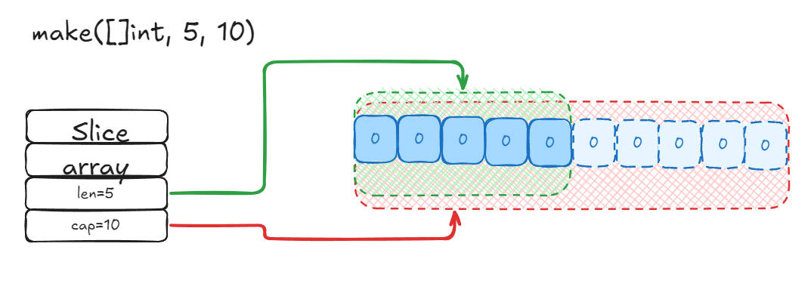
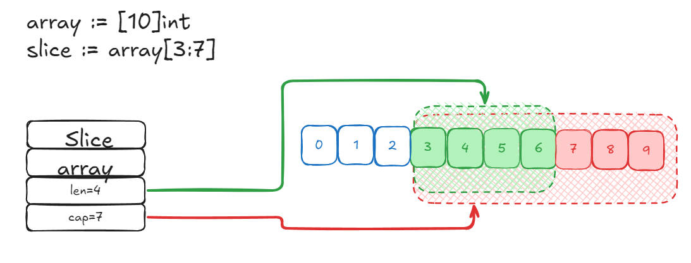

<!-- more -->

### 目录

- [一、Slice 是什么](#一slice-是什么)
- [二、Slice 结构](#二-slice-结构)
- [三、Slice 使用](#三slice-使用)

#### 一、Slice 是什么

> Slice 是 Go 语言中的一种数据结构，它是一个动态数组，可以方便的进行扩容(动态地增加和减少元素)、传递等。

#### 二、 Slice 结构

源码包中 `src/runtime/slice.go:slice` 定义了Slice的数据结构：

```go
type slice struct {
    array unsafe.Pointer
    len   int
    cap   int
}
```

- array：指向底层数组的指针。
- len：Slice 中当前元素的个数。
- cap：Slice 中底层数组的元素个数。

#### 三、Slice 使用

1. 使用make创建Slice

    使用 `make` 创建 Slice 时，可以指定长度和容量，也可以只指定长度。

    ```go
    s1 := make([]int, 5) // 创建一个长度为5，容量为5的Slice
    s2 := make([]int, 5, 10) // 创建一个长度为5，容量为10的Slice
    ```

    

2. 使用字面量创建Slice

    使用字面量创建 Slice 时，可以指定元素个数，也可以不指定。

    ```go
    s1 := []int{1, 2, 3, 4, 5} // 创建一个长度为5，容量为5的Slice，元素为1, 2, 3, 4, 5
    s2 := []int{1, 2, 3} // 创建一个长度为3，容量为3的Slice，元素为1, 2, 3
    ```

3. 使用切片创建Slice

    使用切片创建 Slice 时，可以指定起始位置和结束位置。

    例如：`slice := array[3:7]`, `slice[low : high]`，表示从 `low` 到 `high-1` 的元素。
    

    数组和切片操作可能作用于同一块内存，因此，对数组的修改会影响到切片，反之亦然。

4. Slice 扩容

    当 Slice 的长度超过其容量时，会触发扩容操作。扩容操作会创建一个新的底层数组，并将原 Slice 的元素复制到新数组中。扩容后的 Slice 的容量会根据原 Slice 的长度和容量进行计算。

    ```go
    s := []int{1, 2, 3, 4, 5}
    s = append(s, 6) // 扩容操作
    ```

    扩容操作会根据原 Slice 的长度和容量进行计算，如果原 Slice 的长度小于1024，则新 Slice 的容量为原 Slice 的容量乘以2；如果原 Slice 的长度大于等于1024，则新 Slice 的容量为原 Slice 的长度加上原 Slice 的长度除以4。

5. Slice Copy
    使用 `copy` 函数可以将一个 Slice 的元素复制到另一个 Slice 中，拷贝数量取两个切片长度的最小值。

    ```go
    s1 := []int{1, 2, 3, 4, 5}
    s2 := make([]int, 3)
    copy(s2, s1) // 复制s1的前3个元素到s2中
    ```

    copy 过程中不会扩容。

6. 特殊切片

    根据数组或者切片生成新的切片一般使用 `slice := array[start:end]`，这种新生成的切片并没有指定切片的容量，实际新切片的容量是从start开始到array的结束。

    ```go
    array := [5]int{1, 2, 3, 4, 5}
    slice := array[1:3] // slice := array[1:3:5]
    ```

    还有另一种泻热法，即切片同时也指定容量，即`slice := array[start:end:cap]`，这种切片的容量就是指定的cap，如果cap大于原切片的长度，则新切片的容量就是cap，否则就是原切片的长度。

    ```go
    array := [5]int{1, 2, 3, 4, 5}
    slice := array[1:3:5] // slice := array[1:3:5]
    ```

<div style="text-align: right;">
    <a href="#目录" style="text-decoration: none;">Top</a>
</div>

###### 参考链接如下

- [Go 专家编程](https://www.topgoer.cn/docs/gozhuanjia/gochan4)
