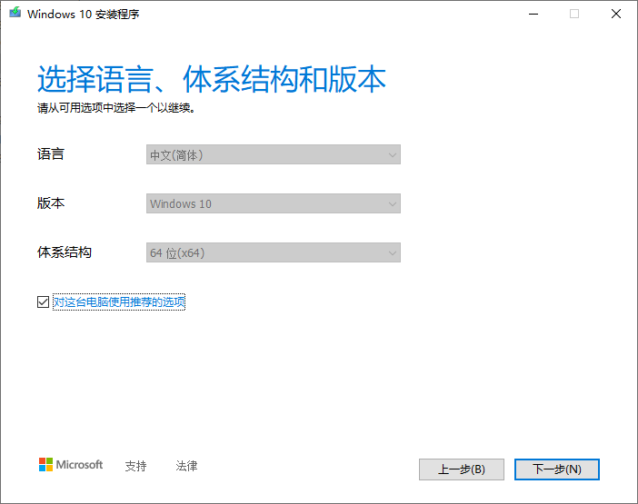
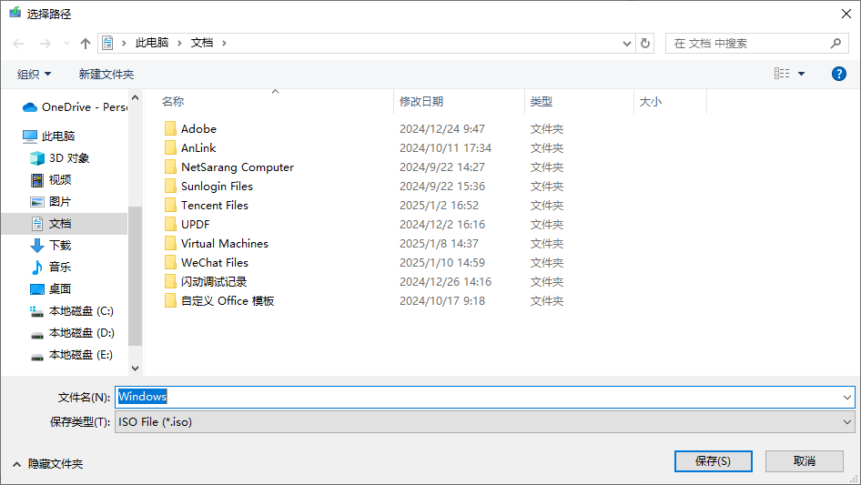
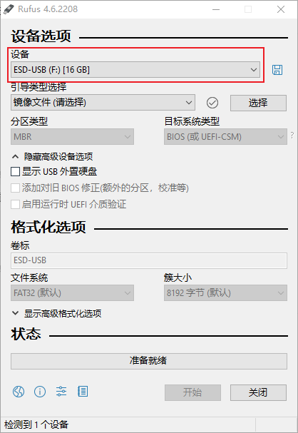
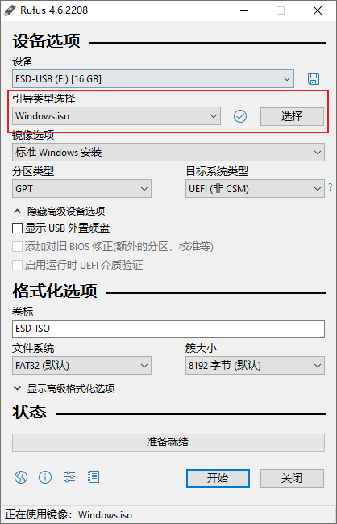
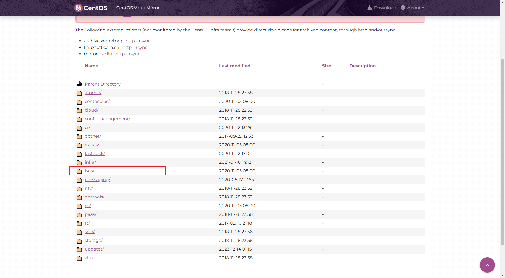
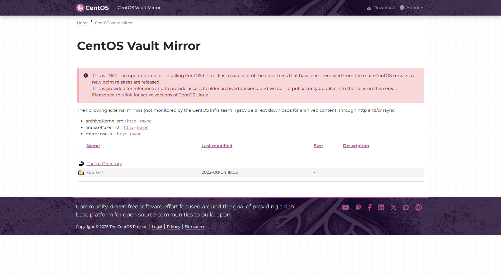
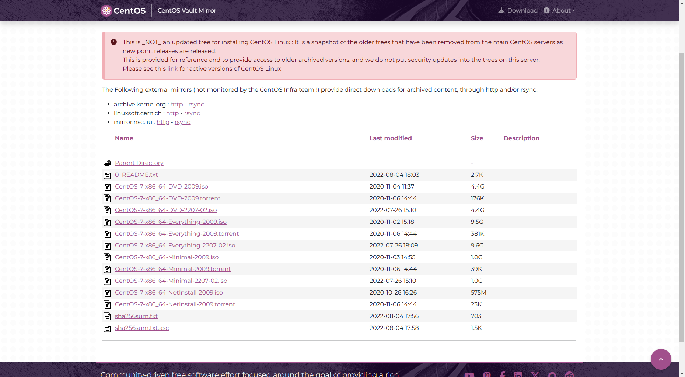
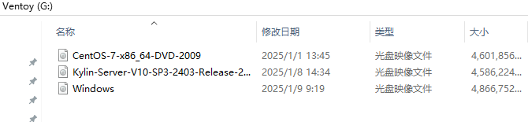

`win、linux、kylin ...`

<!-- more -->
### 目录

- [一、镜像烧录工具](#一镜像烧录工具)
- [二、常用镜像启动盘制作](#二常用镜像制作推荐)
  - [Windows系统镜像(推荐使用官方安装方式)](#windows系统镜像推荐使用官方安装方式)
  - [Centos系统镜像](#centos系统镜像推荐rufsventoy)
  - [Kylin系统镜像](#kylin系统镜像推荐ventoy)

### 一、镜像烧录工具

- Ventoy

    ```
    简单来说，Ventoy是一个制作可启动U盘的开源工具。
    有了Ventoy你就无需反复地格式化U盘，你只需要把 ISO/WIM/IMG/VHD(x)/EFI 等类型的文件直接拷贝到U盘里面就可以启动了，无需其他操作。
    适合系统：https://www.ventoy.net/cn/isolist.html
    url: https://www.ventoy.net/cn/index.html
    ```

- Rufs

    ```
    Rufus 是一个开源的镜像烧录实用工具，可以帮助格式化和创建可引导 USB 闪存盘，比如 USB 随身碟、记忆棒等。Rufus 的体积非常小、但功能全面、速度较快。
    适合系统: Windows 7/8/10
    url: https://rufus.ie/zh/
    ```

- 老毛桃、大白菜、优启通、U启动 等PE系统

    ```
    老毛桃：https://www.laomaotao.net/
    大白菜: https://www.dabaicai.com/u.html
    优启通: https://www.uqitong.com/
    U启动: http://www.uqidong.com/download/
    ```

<div style="text-align: right;">
    <a href="#目录" style="text-decoration: none;">Top</a>
</div>

### 二、常用镜像制作推荐

#### Windows系统镜像(推荐使用官方安装方式)

1. 进入链接 <https://www.microsoft.com/zh-cn/software-download> 选择合适版本进行下载


2. 下载完成后，运行MediaCreationTool_xxx.exe，点击接受
    
3. 选择升级本机或者制作启动盘
    
4. 选择语言、体系结构和版本
    
5. 选择制作U盘或下载ISO文件
    

    - 选择ISO文件
        1. 点击下一步,选择保存路径开始下载，等待下载完成。

            
        2. 下载完成后，使用烧录工具(rufs、ventoy等)进行启动盘制作。
        3. 选择设备

            
        4. 选择镜像

            
        5. 点击开始，会格式化磁盘。

            
        6. 等待操作完成

            
        7. 完成，启动盘制作成功

            
    - 选择U盘
        1. 选择驱动器，点击下一步

            
        2. 等待进度完成

            
        3. 完成，启动盘制作成功

              

<div style="text-align: right;">
    <a href="#目录" style="text-decoration: none;">Top</a>
</div>

#### Centos系统镜像(推荐Rufs、Ventoy)

1. 进入链接 <https://vault.centos.org/> 选择合适版本进入

    
2. 选择isos文件夹进入

    
3. 选择x86_64文件夹进入

    
4. 选择合适镜像地址下载

    
5. 推荐使用IDM加速下载

    
6. 镜像制作(推荐Rufs、Ventoy)，Rufs 参考Windows镜像制作，Ventoy参考Kylin镜像制作。

<div style="text-align: right;">
    <a href="#目录" style="text-decoration: none;">Top</a>
</div>

#### Kylin系统镜像(推荐Ventoy)

1. 进去链接 <https://eco.kylinos.cn/partners/mirror.html?class_id=1> 选择不同系统及镜像进行下载，没有登录需要注册登录。

    
2. 点击下载，根据本地地址进行iso下载，推荐IDM进行下载

    

3. 镜像制作(Ventoy)，点击安装（会对该磁盘进行格式化）

    
4. 制作完成。

    
5. 拷贝镜像到该磁盘目录下，镜像制作成功。

    

<div style="text-align: right;">
    <a href="#目录" style="text-decoration: none;">Top</a>
</div>
