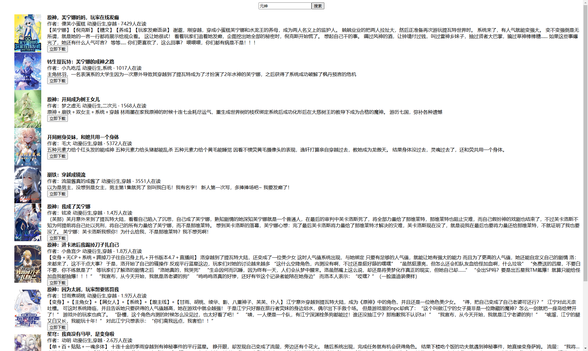

`番茄小说下载测试`

<!-- more -->
### 目录

- [一、协议参考](#一协议参考)
- [二、实现流程](#二实现流程)
- [三、展现方式](#三展现方式)
  
#### 一、协议参考

- 搜索 <https://api5-normal-lf.fqnovel.com/reading/bookapi/search/page/v/?query=%s&aid=1967&channel=0&os_version=0&device_type=0&device_platform=0&iid=466614321180296&passback={{(page-1)*10}}&version_code=999>
- 章节列表 <https://fanqienovel.com/page/{{bookID}}>
- 章节内容 <https://fanqienovel.com/reader/{{chapterID}}>

#### 二、实现流程

- 搜索书籍

  ```
    func SearchHandler(req SearchReq) (*SearchRes, error) {
        keyUrl := fmt.Sprintf("https://api5-normal-lf.fqnovel.com/reading/bookapi/search/page/v/?query=%s&aid=1967&channel=0&os_version=0&device_type=0&device_platform=0&iid=466614321180296&passback={{(page-1)*10}}&version_code=999", req.Query)
        res, err := http.Get(keyUrl)
        if err != nil {
            logrus.Errorf("Error: %s", err)
            return nil, err
        }
        defer res.Body.Close()
        if res.StatusCode != 200 {
            logrus.Errorf("Error: %s", res.Status)
            return nil, err
        }
        buf, err := io.ReadAll(res.Body)
        if err != nil {
            logrus.Errorf("Error: %s", err)
            return nil, err
        }
        var sb SearchRes
        err = json.Unmarshal(buf, &sb)
        if err != nil {
            logrus.Errorf("Error: %s", err)
            return nil, err
        }
        return &sb, nil
    }
  
  ```  

- 获取书籍章节列表

  ```
    func SearchChapter(bookId string) (*SearchChapterRes, error) {
        sr := SearchChapterRes{}
        resp, err := http.Get("https://fanqienovel.com/page/" + bookId)
        if err != nil {
            logrus.Errorf("Error: %s", err)
            return nil, err
        }
        defer resp.Body.Close()

        body, err := ioutil.ReadAll(resp.Body)
        if err != nil {
            logrus.Errorf("Error: %s", err)
            return nil, err
        }

        doc, err := htmlquery.Parse(strings.NewReader(string(body)))
        if err != nil {
            logrus.Errorf("Error: %s", err)
            return nil, err
        }

        links := htmlquery.Find(doc, "//div[@class='chapter']/div/a")
        for _, link := range links {
            text := htmlquery.InnerText(link)
            href := htmlquery.SelectAttr(link, "href")
            if href != "" {
                id, title := dealChapterName(text)
                if id == "" || title == "" {
                    continue
                }
                sr.An = append(sr.An, SearchAn{
                    Title: title,
                    ChapterID:  strings.Split(href, "/")[len(strings.Split(href, "/"))-1],
                    ID: id,
                })
            }
        }

        h1 := htmlquery.FindOne(doc, "//h1")
        if h1 == nil {
            logrus.Errorf("Error: %s", err)
            return nil, nil
        }

        h1Text := htmlquery.InnerText(h1)
        infoLabelYellow := htmlquery.FindOne(doc, "//span[@class='info-label-yellow']")
        if infoLabelYellow == nil {
            logrus.Errorf("Error: %s", err)
            return nil, nil
        }
        sr.Title = h1Text
        sr.Label = htmlquery.InnerText(infoLabelYellow)
        return &sr, nil
    }
  ```

- 获取章节内容

  ```
    func downChapterData(chapterID string) string {
        var n string = "\n"
        for {
            cli := &http.Client{}
            req, err := http.NewRequest("GET", fmt.Sprintf("https://fanqienovel.com/reader/%s", chapterID), nil)
            if err != nil {
                continue
            }
            req.Header.Set("User-Agent", config.GetUserAgent())
            req.Header.Set("cookie", config.GetCookie())
            res, err := cli.Do(req)
            if err != nil {
                continue
            }
            defer res.Body.Close()

            body, err := ioutil.ReadAll(res.Body)
            if err != nil {
                continue
            }
            doc, err := htmlquery.Parse(strings.NewReader(string(body)))
            if err != nil {
                continue
            }

            paragraphs := htmlquery.Find(doc, "//div[@class='muye-reader-content noselect']//p/text()")
            for _, paragraph := range paragraphs {
                n += ("    " + htmlquery.InnerText(paragraph) + "\n")
            }

            break
        }
        if len(n) < 500 {
            time.Sleep(time.Second * 2)
            return downChapterData(chapterID)
        }

        return n
    }
  ```

- 下载章节&章节内容

  ```
    func DownloadHandler(req DownloadReq, bar *widget.ProgressBar) string {
        // 小说 首部处理
        data := "小说名:" + req.BookData.BookName + "\n"
        data += "作者:" + req.BookData.Author + "\n"
        data += "角色:" + req.BookData.Role + "\n"
        data += "标签:" + req.BookData.Tags + "\n"
        abstract := strings.Replace(req.BookData.Abstract, "\n", "\n      ", -1)
        data += ("简介:" + abstract + "\n    \n")
        // 并发下载小说内容
        wg := sync.WaitGroup{}
        wg.Add(len(req.Zhangjie.An))
        // 并发下载小说内容
        ch := make(chan string, 5)
        for k, v := range req.Zhangjie.An {
            go func(k int, v SearchAn) {
                defer wg.Done()
                // 下载章节内容
                txt := downZjText(v.ZjId)
                // 章节内容字符转换
                ntxt := strInterpreter(txt, 0)
                // 拼接章节内容
                req.Zhangjie.An[k].Data = ntxt
                ch <- v.ZjStr
            }(k, v)
        }
        var successCount int
        for i := 0; i < len(req.Zhangjie.An); i++ {
            tmp := <-ch
            fmt.Println("第" + tmp + "章" + " 下载完成")
            successCount++
            fmt.Printf("下载进度: %.2f "+"%%\n", float64(successCount)/float64(len(req.Zhangjie.An))*100)
            bar.SetPos(int(float64(successCount) / float64(len(req.Zhangjie.An)) * 100))
            bar.Redraw(true)
        }
        wg.Wait()
        close(ch)
        // 组装小说内容
        for _, v := range req.Zhangjie.An {
            // 添加标题
            data += ("第" + v.ZjStr + "章 " + v.Title)
            // 添加内容
            data += (v.Data + "\n")
        }
        return data
    }
  ```

- 注意事项
  - 内容无法下载

    ```
       内容无法下载是因为下载需要进行Cookie校验，不符合规则的Cookie无法下载。
    - 解决方案
        - 随机一定长度的字符串
        - 进行章节内容下载测试
        - 下载章节内容符合要求，设置Cookie。否则重新随机。
        - Cookie 可在初始化时设置，也可以在下载时设置。
    ```

  - 乱码及格式转换

    ```
       章节内容/小说名/章节名 乱码是因为内容需要进行字符转换。
    - 解决方案
        - 字符转换
        - 阿拉伯数字/大写数字 转换、多零转换 
    ```

#### 三、展现方式

- 客户端方式
  

- 网页方式
  

- 文章分享
  <https://www.52pojie.cn/forum.php?mod=viewthread&tid=1998711&page=1&extra=#pid52197275>  
