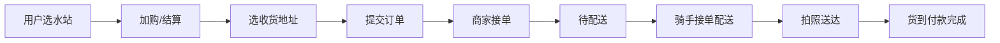

本文记录 **WaterSite（多租户水站售水系统）** 从选型、建模、本地联调到服务器域名与小程序上线的完整流程。代码仓库即本项目，路径与命令均来自真实工程，便于按图索骥。

<!-- more -->

## 目录

- [一、业务与产品模型](#一业务与产品模型)
- [二、技术选型与仓库结构](#二技术选型与仓库结构)
- [三、数据库与领域模型](#三数据库与领域模型)
- [四、后端：搭建与调试](#四后端搭建与调试)
- [五、平台 / 商家 Web 管理端](#五平台--商家-web-管理端)
- [六、用户小程序（含骑手）](#六用户小程序含骑手)
- [七、服务器、域名与 Nginx](#七服务器域名与-nginx)
- [八、小程序隐私保护与审核](#八小程序隐私保护与审核)
- [九、微信开发者工具与真机调试](#九微信开发者工具与真机调试)
- [十、构建上传与预览发布](#十构建上传与预览发布)
- [十一、常用命令速查](#十一常用命令速查)

---

## 一、业务与产品模型

### 1.1 角色划分

| 角色 | 使用端 | 主要能力 |
|------|--------|----------|
| **平台运营** | `frontend/apps/admin` | 审核商家、看全平台订单与数据 |
| **水站商家** | `frontend/apps/merchant` | 商品、订单、骑手、骑士码、押金卡 |
| **终端用户** | `miniprogram-user` | 选水站、下单、地址、押金卡、收藏 |
| **配送骑手** | 同上（绑定骑士码后切换） | 接单、地图导航、送达拍照 |

骑手端已**融合进用户小程序**，不再单独维护 H5 / 独立骑手小程序。商家在后台生成「骑士码」，骑手在用户小程序「我的」里绑定后切换到骑手模式。

### 1.2 核心业务流程（简化）



桶装水场景还要处理：**押桶 / 退桶 / 押金卡**，模型里用 `DepositBucketCount`、`ReturnBucketCount`、`UserDepositCard` 等字段表达，细节见 `backend/internal/model/admin/`。

---

## 二、技术选型与仓库结构

### 2.1 为什么这样选

| 层次 | 选型 | 理由 |
|------|------|------|
| 后端 | **Go 1.21 + Kratos v2** | 与团队现有 HuiWan 系项目一致，gRPC/HTTP 双协议，Proto 契约清晰 |
| 数据库 | **MySQL 5.7 + GORM** | 订单、多租户商家关系适合关系型；AutoMigrate 迭代快 |
| 缓存 | **Redis 5** | 登录 Token、会话、地理编码缓存 |
| 管理前端 | **Vite + React 18 + TS + Tailwind** | 平台 / 商家两套 SPA，独立端口开发 |
| 用户端 | **Taro 4 + React + 微信小程序** | 一套代码编译 weapp；替代原 H5 |
| 部署 | **Docker Compose + Nginx** | 后端与中间件容器化；静态资源与 API 反代 |

### 2.2 仓库目录（根目录 `watersite/`）

```
watersite/
├── backend/                 # Go 后端（API、上传、微信登录）
├── frontend/
│   └── apps/
│       ├── admin/           # 平台管理  → 默认端口 5175
│       └── merchant/        # 商家管理  → 默认端口 5176
├── miniprogram-user/        # 微信小程序（用户购水 + 骑手）
├── WATERSITE-DEVELOPMENT-GUIDE.md # 本文（含隐私指引配置全文）
└── README.md
```

---

## 三、数据库与领域模型

### 3.1 核心表（逻辑）

模型定义在 `backend/internal/model/admin/`，GORM 启动时自动迁移。与送水业务最相关的几张表：

| 模型 | 文件 | 说明 |
|------|------|------|
| `Merchant` | `admin.go` | 水站商家、登录账号、经纬度、营业时间 |
| `Product` | `admin.go` | 商品（桶装水/水票等）、价格、库存 |
| `Order` | `admin.go` | 订单号、用户地址、骑手、状态流转、签收图 |
| `Rider` | `admin.go` | 骑手归属商家、在线状态 |
| `UserAddress` | `address.go` | 用户收货地址（含 lat/lng） |
| `UserDepositCard` | 押金相关 | 押桶押金卡 |

订单状态常量（代码里直接用中文，与前端展示一致）：

```go
OrderStatusPending    = "待处理"
OrderStatusToDeliver  = "待配送"
OrderStatusDelivering = "配送中"
OrderStatusDone       = "配送完成"
OrderStatusCancelled  = "已取消"
```

### 3.2 API 契约

- 接口定义：`backend/api/v1/*.proto`
- 生成代码：`cd backend && make all`（需本机安装 protoc）
- 用户端 REST 前缀：`/watersite/user/...`
- 商家端：`/watersite/merchant/...`
- 骑手端：`/watersite/rider/...`
- 文件上传：`POST /watersite/file/upload`（小程序送达照、头像等）

---

## 四、后端：搭建与调试

### 4.1 本地第一次跑起来

```bash
cd backend

# 安装 proto 等工具（仅需一次）
make init

# 生成 pb 代码（改 proto 后执行）
make all

# 启动 MySQL + Redis + 后端（推荐）
make up
# 等价于：docker compose up -d --build
```

健康检查：

```bash
curl http://127.0.0.1:8000/health
```

默认平台管理员（首次启动自动初始化）：`admin` / `admin123`。

### 4.2 配置文件

| 环境 | 配置文件 |
|------|----------|
| 本地直连远程库 | `backend/conf/config.yaml` |
| Docker 容器内 | `backend/conf/config.docker.yaml`（挂载为 `/app/conf/config.yaml`） |

需要填的关键项：

```yaml
server:
  mysql: { host, port, user, pwd, db }
  redis: { addr }
  geocode:
    api_key: "高德 Web 服务 Key"    # 商家/地址地理编码
  wechat_mini_program:
    app_id: "wx********"
    app_secret: "********"           # 勿提交 git
```

微信 `app_secret` 为空时，登录会走开发模式（`dev_` 前缀 OpenID），真机微信登录必须配齐。

### 4.3 生产 Compose

```bash
docker network create watersite 2>/dev/null || true
cd backend
docker compose -f docker-compose.prod.yaml up -d --build
```

端口映射（宿主机）：

| 服务 | 端口 |
|------|------|
| HTTP API | 8000 |
| gRPC | 9000 |
| MySQL | 13306 |
| Redis | 16379 |

上传文件持久化在 `backend/data/uploads/`，Nginx 通过 API 域名 `/watersite/uploads/` 对外提供 HTTPS 访问。

---

## 五、平台 / 商家 Web 管理端

### 5.1 安装与启动

```bash
cd frontend
npm install

# 平台管理后台 → http://127.0.0.1:5175
npm run dev:admin

# 商家管理后台 → http://127.0.0.1:5176
npm run dev:merchant
```

环境变量（各 app 的 `.env` 或 Vite 配置）：`VITE_API_BASE` 指向后端，例如 `http://127.0.0.1:8000` 或 `https://water.qqyyds.cn`。

### 5.2 页面与联调顺序（建议）

1. **平台 admin**：登录 → 商家列表 → 审核/启用商家  
2. **商家 merchant**：登录 → 商品上架 → 店铺设置 → **生成骑士码**  
3. **商家 merchant**：订单列表 → 接单 → 订单进入「待配送」  
4. 再用小程序下单、骑手配送，回到商家端看状态是否同步  

### 5.3 生产构建

```bash
cd frontend
npm run build:admin
npm run build:merchant

# 或 Docker 构建静态镜像
npm run docker:build
npm run docker:up
```

商家后台生产域名示例：`merchant.qqyyds.cn`（见下文 Nginx）。

---

## 六、用户小程序（含骑手）

### 6.1 技术栈与目录

- 框架：**Taro 4.0.9 + React 18 + TypeScript + Sass**
- 源码：`miniprogram-user/src/`
- 编译输出：`miniprogram-user/dist/`（微信开发者工具导入此目录）

关键页面：

| 路径 | 说明 |
|------|------|
| `pages/home` | 首页、选水站 |
| `pages/cart` / `checkout` | 购物车、结算 |
| `pages/addresses` | 收货地址、**地图选点** |
| `pages/rider/orders` | 骑手订单列表 |
| `pages/rider/order-detail` | 接单、导航、**拍照上传** |
| `pages/bind-rider-code` | 绑定骑士码 |

API 地址在 `miniprogram-user/src/config/api.ts`：

```ts
export const API_BASE_URL = 'https://water.qqyyds.cn'
```

**改完必须重新编译**，小程序不会读运行时环境变量。

### 6.2 本地开发命令

```bash
cd miniprogram-user
npm install
npm run dev:weapp    # 监听编译，输出到 dist/
```

另开微信开发者工具 → 导入项目 → 目录选 **`miniprogram-user`**（或 `dist/`，视 `project.config.json` 里 `miniprogramRoot` 而定）。

开发阶段务必勾选：**详情 → 本地设置 → 不校验合法域名、web-view、TLS 版本以及 HTTPS 证书**。  
否则本地 IP 或自签证书接口会被拦。

### 6.3 骑手相关实现要点

- 图片 URL：`lib/asset-url.ts` 的 `resolveRiderImageUrl`，只加载业务域名 HTTPS 图  
- 导航：`lib/location.ts` + `lib/media.ts` 的 `openAddressNavigation`（复制地址 + `openLocation`）  
- 拍照：`lib/media.ts` 的 `pickLocalImage` → `api/upload.ts`  
- 隐私弹窗：`components/PrivacyPopup` + `app.ts` 里 `onNeedPrivacyAuthorization`

---

## 七、服务器、域名与 Nginx

### 7.1 安全组 / 防火墙

云服务器**必须放行**：

| 端口 | 用途 |
|------|------|
| **80** | HTTP（跳转 HTTPS） |
| **443** | HTTPS（小程序、管理后台、API） |
| 8000 | 可选，仅内网或调试时对外开放 API |
| 22 | SSH |

生产建议：**只对外 80/443**，API 走 Nginx 反代，不要直接把 8000 暴露公网。

### 7.2 域名规划（本项目示例）

| 域名 | 用途 |
|------|------|
| `water.qqyyds.cn` | 小程序 API + 上传文件 HTTPS |
| `merchant.qqyyds.cn` | 商家管理后台 |

DNS：A 记录指向服务器公网 IP。证书可用 Let's Encrypt 或云厂商免费证书，放到 `backend/conf/` 对应 `water.pem` / `water.key`。

### 7.3 Nginx 配置参考

项目内完整示例：`backend/conf/nginx.conf`。

要点：

```nginx
# HTTP → HTTPS
server {
    listen 80;
    server_name water.qqyyds.cn;
    return 301 https://water.qqyyds.cn$request_uri;
}

# API 反代到后端容器
server {
    listen 443 ssl;
    server_name water.qqyyds.cn;

    ssl_certificate     water.pem;
    ssl_certificate_key water.key;

    location / {
        proxy_pass http://127.0.0.1:8000;   # 或 Docker 网桥 IP:8000
        proxy_set_header Host              $host;
        proxy_set_header X-Real-IP         $remote_addr;
        proxy_set_header X-Forwarded-For   $proxy_add_x_forwarded_for;
        proxy_set_header X-Forwarded-Proto $scheme;
        client_max_body_size 8m;            # 上传图片
    }
}
```

商家后台 `merchant.qqyyds.cn` 反代到前端静态服务端口（如 `5176` 或 Docker 映射的 `8081`）。

配置改完后：

```bash
nginx -t && nginx -s reload
```

### 7.4 微信小程序「服务器域名」配置

登录 [微信公众平台](https://mp.weixin.qq.com) → 开发 → 开发管理 → 开发设置 → **服务器域名**：

| 类型 | 域名 |
|------|------|
| request 合法域名 | `https://water.qqyyds.cn` |
| uploadFile 合法域名 | `https://water.qqyyds.cn` |
| downloadFile 合法域名 | `https://water.qqyyds.cn` |

须已备案且 HTTPS 证书有效。开发阶段可用「不校验合法域名」绕过，**提审前必须配好**。

---

## 八、小程序隐私保护与审核

微信自 2023 年起强制配置《用户隐私保护指引》。未声明的隐私接口会被直接禁用，提审也会被驳回。本节给出**公众平台后台逐项填写内容**（可直接复制），与 `miniprogram-user` 当前代码一致。

### 8.1 配置入口

登录 [微信公众平台](https://mp.weixin.qq.com) → **设置** → **基本设置** → **服务内容声明** → **用户隐私保护指引** → **去完善** / **增加信息类型**

保存后约 **5 分钟** 生效，再重新编译上传小程序并在真机验证。

### 8.2 必勾 8 项及用途文案（复制到后台）

在后台点击 **「增加信息类型」**，逐项添加并填写 **用途**：

#### （1）位置信息（Location）

- **对应能力：** `wx.getLocation`（`app.config.ts` 的 `requiredPrivateInfos` 已声明）
- **使用场景：** 首页、水站列表推荐附近水站

**用途：**

```
用于获取您的大致地理位置，推荐附近水站并计算配送距离。
```

#### （2）选择的位置信息（ChooseLocation）

- **对应能力：** `wx.chooseLocation`（`requiredPrivateInfos` 已声明）
- **使用场景：** 收货地址页「从地图选择位置」

**用途：**

```
用于在新增或编辑收货地址时，通过地图选择收货位置并自动填充地区与详细地址。
```

#### （3）地址（Address）

- **对应能力：** 用户填写收货人、省市区、门牌号（业务表单）
- **使用场景：** 下单、保存收货地址、配送履约

**用途：**

```
用于您下单时填写、保存收货地址，以便水站备货和骑手配送商品。
```

#### （4）手机号码（PhoneNumber）

- **对应能力：** `button open-type="getPhoneNumber"`（`pages/bind-phone`）
- **使用场景：** 账号绑定与安全验证

**用途：**

```
用于账号安全验证、订单配送联系及售后服务沟通。
```

#### （5）用户信息（微信昵称、头像）（UserInfo）

- **对应能力：** `open-type="chooseAvatar"`、昵称输入框（`pages/login`、`pages/settings`）
- **使用场景：** 用户**主动**设置头像与昵称，个人中心展示

**用途：**

```
用于您在登录页或个人设置页主动设置头像和昵称，并在个人中心展示账户资料。
```

> **审核注意：** 勿写「微信一键登录自动获取头像昵称」，易被驳回。本小程序为用户主动选择/填写，非静默拉取微信资料。

#### （6）摄像头（Camera）

- **对应能力：** `wx.chooseMedia` / `wx.chooseImage` 选「拍照」；`scope.camera`
- **使用场景：** 骑手送达/取桶拍照；用户设置头像时拍照

**用途：**

```
用于骑手拍摄订单送达、上门取桶凭证照片，以及用户拍摄个人头像并上传。
```

#### （7）选中的照片或视频信息（Album）

- **对应能力：** `wx.chooseMedia` / `wx.chooseImage` 从相册选图
- **使用场景：** 用户换头像；骑手从相册选图上传凭证

**用途：**

```
用于用户从相册选择图片，设置个人头像，以及骑手上传送达/取桶凭证照片。
```

#### （8）剪切板（Clipboard）

- **对应能力：** `wx.setClipboardData`
- **使用场景：** 骑手订单详情复制收货地址导航；登录页复制 OpenID（调试）

**用途：**

```
用于复制收货地址以便在地图应用中导航，以及复制账号相关信息便于您自行保存。
```

### 8.3 汇总对照表

| 后台隐私类型 | 小程序使用场景 | 代码位置 | 用户是否必选 |
|-------------|---------------|----------|-------------|
| 位置信息 | 推荐附近水站 | `lib/location.ts` · `getCurrentLocation` | 否 |
| 选择的位置信息 | 收货地址地图选点 | `pages/addresses` · `chooseMapLocation` | 否 |
| 地址 | 收货人、省市区、门牌号 | `pages/addresses` · 地址表单 | 下单必填 |
| 手机号码 | 绑定手机号 | `pages/bind-phone` | 否 |
| 用户信息（昵称、头像） | 登录/设置页设置资料 | `pages/login` · `pages/settings` | 否 |
| 摄像头 | 骑手拍照、头像拍照 | `lib/media.ts` · `scope.camera` | 否 |
| 选中的照片或视频信息 | 相册选图上传 | `lib/media.ts` · `chooseMedia` | 否 |
| 剪切板 | 复制地址导航 | `lib/media.ts` · `openAddressNavigation` | 否 |

### 8.4 不要勾选的项目

| 类型 | 原因 |
|------|------|
| 相册（仅写入）AlbumWriteOnly | 未调用 `saveImageToPhotosAlbum` |
| 麦克风 Record | 未使用录音 |
| 微信运动 RunData | 未使用 |

### 8.5 与 `app.config.ts` 的关系

**`requiredPrivateInfos` 只能填位置类接口**（微信限制，不可填 Camera、Album 等）：

```ts
// miniprogram-user/src/app.config.ts
requiredPrivateInfos: ['getLocation', 'chooseLocation'],
permission: {
  'scope.userLocation': {
    desc: '用于收货地址地图选点、推荐附近水站',
  },
  'scope.camera': {
    desc: '用于骑手送达、取桶时拍照上传凭证',
  },
},
__usePrivacyCheck__: true,
```

摄像头、相册、手机号、昵称头像、剪切板等 **只在公众平台「用户隐私保护指引」声明**，不要写入 `requiredPrivateInfos`（写了会编译报错）。

### 8.6 小程序内授权流程（代码侧）

1. 用户触发隐私接口（选图、地图、定位等）→ 可能弹出 **用户隐私保护提示**（`components/PrivacyPopup` + `open-type="agreePrivacyAuthorization"`）。
2. 用户点击 **「同意」** 后，微信记录同步，方可调用已声明接口。
3. 拍照另需系统 **相机权限**（`scope.camera`）；地图选点另需 **定位权限**（`scope.userLocation`）。

| 模块 | 路径 |
|------|------|
| 隐私弹窗 | `miniprogram-user/src/components/PrivacyPopup/` |
| 隐私授权 | `miniprogram-user/src/lib/privacy.ts` · `privacy-auth.ts` |
| 地图/定位 | `miniprogram-user/src/lib/location.ts` |
| 拍照/相册 | `miniprogram-user/src/lib/media.ts` |
| scope 权限 | `miniprogram-user/src/lib/permission.ts` |

### 8.7 常见审核驳回与排查

| 现象 / 驳回原因 | 处理 |
|----------------|------|
| 昵称、头像说明不符合场景 | 用途改为「用户主动设置」，勿写自动获取 |
| 未声明 Camera/Album 却调用选图 | 在指引中补充摄像头、相册两项 |
| 地图选点打不开 | 补充「选择的位置信息」+ 真机点隐私弹窗「同意」 |
| 拍照一直转圈 | 勾选 Camera/Album；真机测；检查 upload 合法域名 |
| errno 112 / scope not declared | 指引补充对应类型，保存 5 分钟后重试 |
| errno 103 / 104 | 用户拒绝或未同意隐私协议，清授权数据后重试 |

### 8.8 提审前自检清单

- [ ] 公众平台已添加上述 **8 项**（或当前实际使用的全部项）
- [ ] 每项 **用途** 与 8.2 节一致或语义相同
- [ ] 隐私指引 **审核已通过**
- [ ] 已执行 `npm run build:weapp` 并上传体验版
- [ ] 真机验证：地图选点、拍照上传、绑定手机号
- [ ] 小程序内《隐私政策》页（`pages/privacy-policy`）与后台说明不矛盾

### 8.9 可选：订单信息

若后台提供 **订单信息（EXOrderInfo）** 且要求填写：

```
用于记录您的订水订单、配送状态、押桶退桶信息及售后查询。
```

---

## 九、微信开发者工具与真机调试

### 9.1 开发者工具

1. 安装 [微信开发者工具](https://developers.weixin.qq.com/miniprogram/dev/devtools/download.html)  
2. 导入 `miniprogram-user`，AppID 填正式或测试号  
3. 先跑 `npm run dev:weapp`，工具指向 `dist/`  
4. **模拟器**：可测页面跳转、登录；**相机 / 定位往往不准**  
5. **清缓存**：工具 → 清缓存 → 清除授权数据（隐私授权乱了时用）

### 9.2 真机调试（推荐）

| 步骤 | 操作 |
|------|------|
| 1 | 开发者工具 → 预览 → 扫二维码 |
| 2 | 手机微信打开体验版 |
| 3 | 测：地图选地址、下单、骑手拍照上传、导航 |
| 4 |  vConsole：可在工具里打开调试，看手机端报错 |

真机必须能访问 `https://water.qqyyds.cn`（关闭「不校验域名」后测一遍）。

### 9.3 骑手联调检查单

- [ ] 商家后台已创建骑手账号 / 骑士码  
- [ ] 小程序「我的」→ 绑定骑士码 → 切换到骑手  
- [ ] 商家已将订单推到「待配送」  
- [ ] 骑手接单 → 复制地址 / 打开地图 → 拍照上传 → 确认送达  
- [ ] 商家端、用户端订单状态一致  

---

## 十、构建上传与预览发布

### 10.1 生产构建小程序

```bash
cd miniprogram-user
npm run build:weapp
```

确认 `src/config/api.ts` 为生产 API 地址后再编。

### 10.2 上传代码

1. 微信开发者工具 → **上传**  
2. 填写版本号、备注（例：`v1.0.0 骑手拍照与地图选点`）  
3. 登录公众平台 → **管理 → 版本管理 → 开发版本**  
4. 选为体验版 → 扫码给测试人员  

### 10.3 提交审核

1. 版本管理 → 提交审核  
2. 类目选「生活服务」相关（送水 / 饮用水配送等）  
3. 隐私指引已按本文 **第八章** 配置完成  
4. 审核备注可写：测试账号、骑士码、下单流程说明  

### 10.4 发布

审核通过后 → **全量发布**。发布后用户隐私指引更新时，老用户对新声明的接口需重新同意。

---

## 十一、常用命令速查

### 后端

```bash
cd backend
make up                    # Docker 启动全套
make down                  # 停止
make docker-logs           # 看后端日志
go run ./cmd/server -conf ./conf   # 裸跑（需自备 MySQL/Redis）
curl http://127.0.0.1:8000/health
```

### 管理前端

```bash
cd frontend
npm run dev:admin
npm run dev:merchant
npm run build
```

### 小程序

```bash
cd miniprogram-user
npm run dev:weapp          # 开发监听
npm run build:weapp        # 生产包
```

### Docker 运维

```bash
docker ps
docker logs -f watersite
docker logs -f mysql57
docker compose -f docker-compose.prod.yaml restart watersite
```

### 部署相关（可选）

根目录 `.env.deploy.example` 记录了远程主机示例，可按需写自己的部署脚本（SSH、rsync、compose pull），**勿把密码提交 git**。

---

## 附录：推荐阅读顺序（新人上手）

1. 读 `README.md` 了解全貌  
2. `backend/README.md` 起后端  
3. `frontend/DEVELOPMENT.md` 起管理端  
4. `miniprogram-user/README.md` + `docs/06-env-and-deploy.md`  
5. 提审前对照本文 **第八章** 逐项检查隐私指引  

整套系统没有银弹，**后端先通 → 商家能上架 → 小程序能下单 → 骑手能送**，按这个顺序联调最省时间。遇到域名、隐私、上传三类问题，九成在 Nginx 443、公众平台域名白名单和隐私指引三项没对齐——先查这三处，再查代码。

---

*文档随仓库演进更新；若目录或端口有变更，以各子目录 README 为准。*
