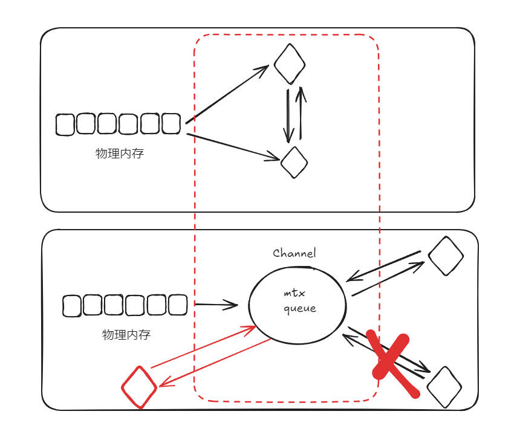

- 特征
  - 语法简单，易懂，所见即所得
  - 并发模型 goroutine
    goroutine
    <https://www.cnblogs.com/abozhang/p/10766689.html>
    待学习
    暂停

    搭配 channel 实现的CSP 模型，不要通过共享内存来通信，而是通过通信来共享内存
    直接通过数据地址内存进行共享交互，建立缓冲区队列，通过读取写入缓存区通信 进行内存共享
    1. 解耦：通过通信来共享内存，可以降低进程或线程之间的耦合度。不同的进程或线程可以通过消息传递来共享数据，而不需要知道对方的具体实现细节。

    2. 灵活性：通过通信来共享内存，可以更容易地实现分布式计算。不同的进程或线程可以运行在不同的机器上，通过网络进行通信。

    3. 安全性：通过通信来共享内存，可以更容易地实现数据的安全性和一致性。可以通过消息传递来确保数据的完整性和一致性，而不需要直接操作内存。

    4. 可扩展性：通过通信来共享内存，可以更容易地实现系统的可扩展性。可以通过增加进程或线程的数量来提高系统的处理能力。
    
